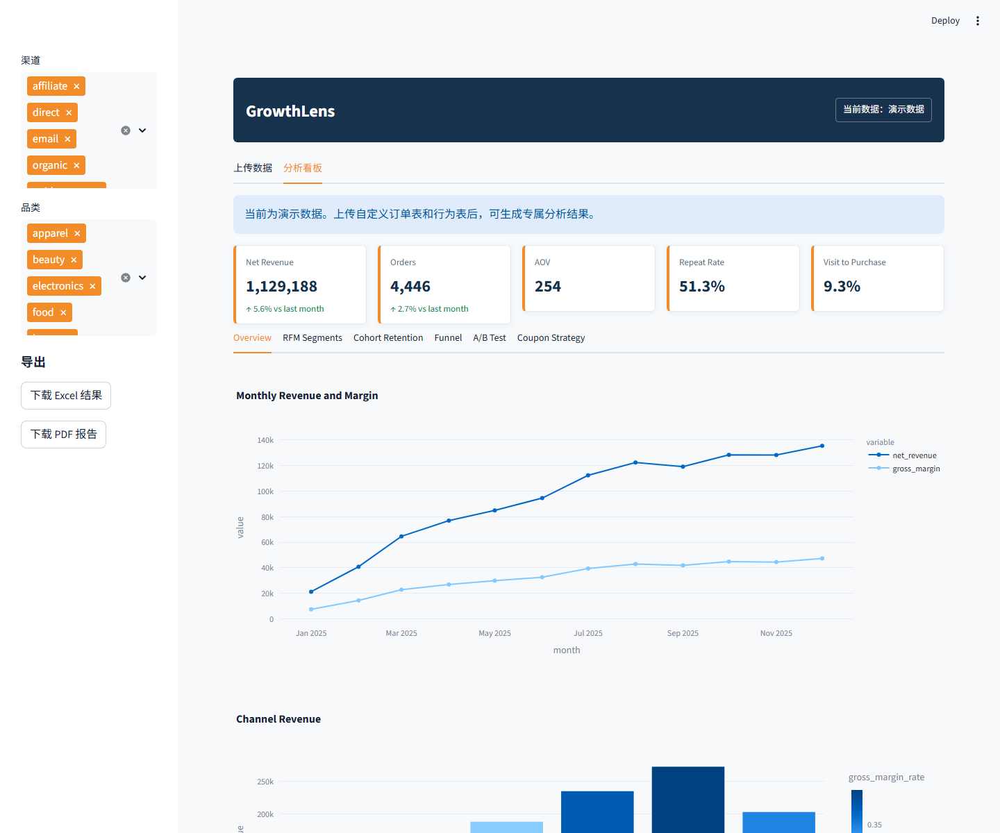
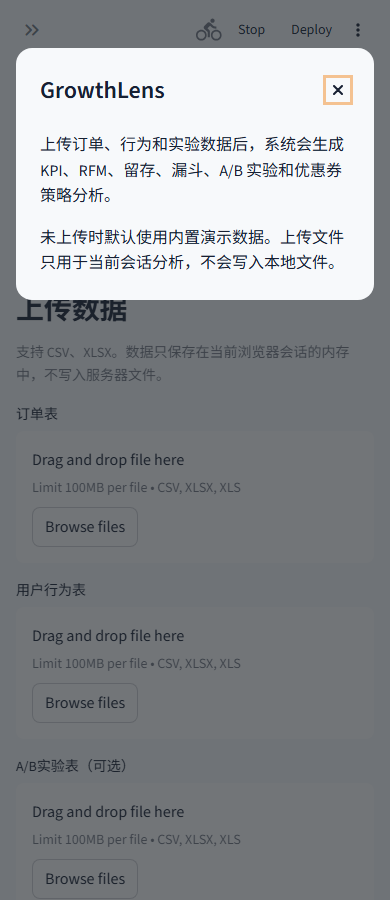

# GrowthLens 电商增长分析看板作品集

从固定演示数据升级为可上传、可映射、可导出的自助式增长分析产品

- 角色：产品设计 / 数据分析 / Streamlit 全栈实现 / 部署准备
- 在线访问：https://ecommerce-growth-strategy-dashboardbranchmainmainfilepathapppy.streamlit.app/
- GitHub：https://github.com/linjiayi497-max/ecommerce-growth-strategy-dashboard
- 项目一句话：用户上传订单、行为和实验数据后，系统自动生成 KPI、RFM、留存、漏斗、A/B 实验和优惠券策略分析，并支持 PDF/Excel 导出。

## 1. 产品定位与用户问题

- 目标用户：电商运营、增长分析、商业分析和数据分析实习岗位相关使用者。
- 核心问题：传统演示看板只能看样例数据，无法让用户带入自己的订单和行为数据验证分析结果。
- 产品目标：让非技术用户通过上传 CSV/XLSX，在浏览器内完成增长诊断、客群识别、实验判断和报告导出。
- 隐私边界：上传文件只保存在当前 Streamlit 会话内存中，不写入本地文件或服务器文件。

## 2. 用户流程

| 阶段 | 产品动作 |
| --- | --- |
| 上传数据 | 支持订单表、用户行为表和可选 A/B 实验表；未上传时默认使用演示数据。 |
| 字段映射 | 自动识别 user_id、amount、created_at 等常见字段，并允许用户用下拉框修正。 |
| 统一口径 | 映射为 customer_id、order_date、net_revenue、event_type、event_time 等 canonical schema。 |
| 分析看板 | 输出 KPI、RFM 分层、cohort 留存、访问-购买漏斗、A/B 实验和优惠券策略。 |
| 导出结果 | 侧边栏提供 Excel 多 sheet 和 PDF 报告下载。 |

## 3. 核心界面展示

主看板采用深蓝+橙色的 SaaS 风格，顶部展示当前数据来源，侧边栏提供筛选和导出，主体按增长分析模块组织。

## 4. 数据接口与字段设计

| 数据表 | 字段口径 |
| --- | --- |
| 订单表必填 | customer_id、order_date、net_revenue。 |
| 订单表可选 | order_id、gross_margin、coupon_spend、returned、channel、category、device。 |
| 行为表必填 | customer_id、event_type、event_time。 |
| 行为表可选 | session_id、channel、device、category。 |
| A/B 实验表 | variant、converted 必填；customer_id 或 session_id 至少一个。 |

## 5. 分析模块

- KPI：GMV/净收入、订单量、客单价、复购率、访问到购买转化率。
- RFM：按最近购买、购买频次和消费金额识别高价值用户、潜力用户和流失风险用户。
- Cohort 留存：按首购月份构造留存矩阵，观察长期用户价值。
- 漏斗分析：基于 view、cart、checkout、purchase 等事件计算分步骤转化。
- A/B 实验：在实验数据存在时计算 control/treatment 转化率、uplift、p-value 和每 session 收入。
- 优惠券策略：结合 coupon_spend、margin 和客群表现输出促销效率分析。

## 6. 技术架构

| 层级 | 实现 |
| --- | --- |
| 前端 | Streamlit 单体应用，自定义 CSS，Plotly 交互图表。 |
| 数据处理 | pandas 清洗、字段映射、schema 校验、演示数据 fallback。 |
| 分析服务 | src/ecommerce_growth/analytics.py 承载 KPI、RFM、留存、漏斗和实验计算。 |
| 导出服务 | openpyxl / pandas 生成 Excel，多 sheet；reportlab 生成 PDF 报告。 |
| 测试 | 上传、字段映射、缺字段报错、导出文件生成等单元测试。 |

## 7. Demo 结果口径

- 演示数据覆盖 4,446 笔订单、115,915 条行为事件和 47,571 条实验曝光。
- 主看板示例指标：净收入 1,129,188，订单量 4,446，客单价 254，复购率 51.3%，访问到购买转化率 9.3%。
- 产品不会把演示结论包装成真实公司数据；上传数据后会替换为用户自己的分析结果。

## 8. 产品亮点

- 从“看静态 dashboard”升级为“用户自助分析工具”，更适合公开演示和简历作品集。
- 字段映射兼容不同 CSV/Excel 命名习惯，降低非技术用户使用门槛。
- A/B 数据缺失时自动隐藏实验模块，其他分析不中断。
- 报告导出让结果可以被带走，形成运营复盘和面试展示材料。

## 9. 面试可讲点与后续迭代

- 如何设计字段映射，平衡自动识别与用户可控性。
- 为什么 RFM、cohort、漏斗和 A/B 是增长分析的核心组合。
- 如何处理上传数据质量问题、缺失字段和异常值。
- 后续可接入数据库/数据仓库，加入 LTV、归因模型和自动策略建议。
